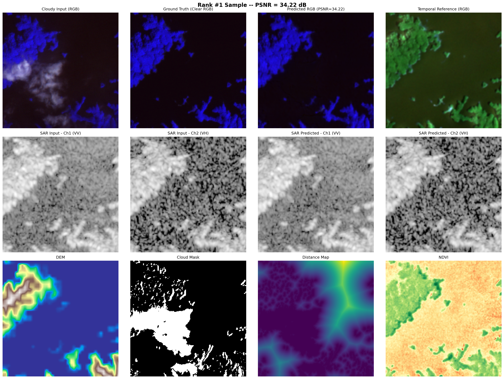
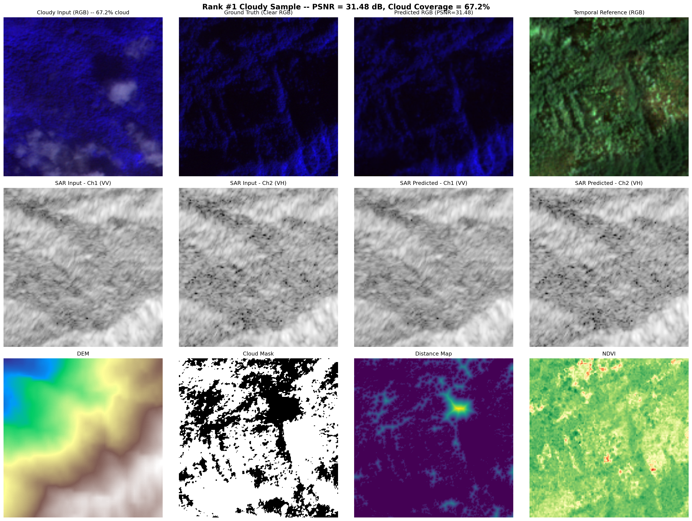
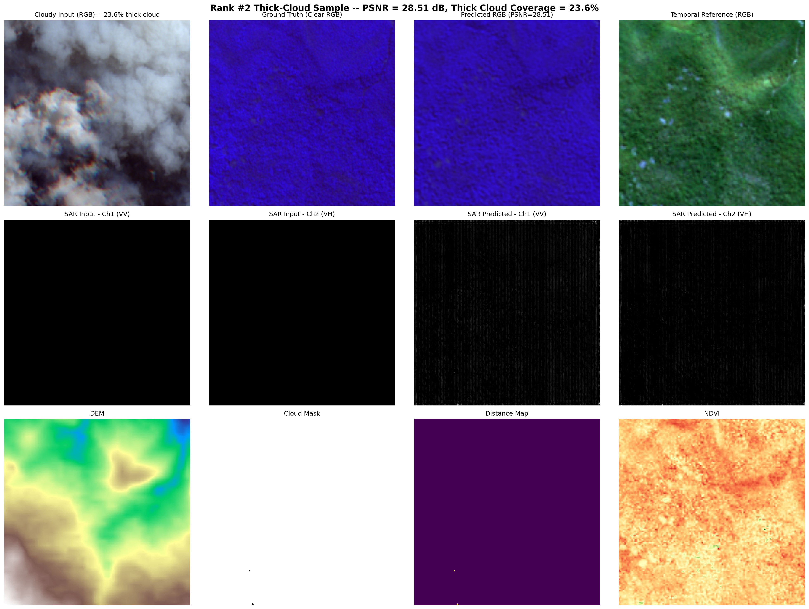
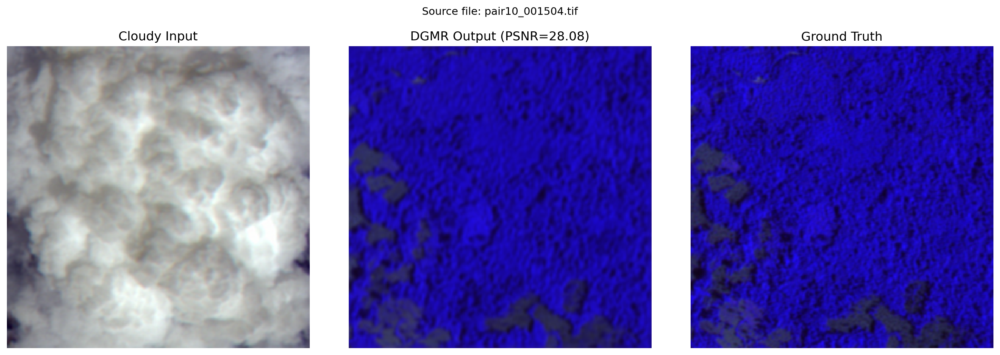
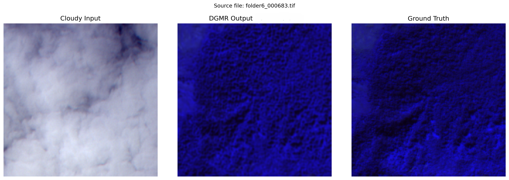
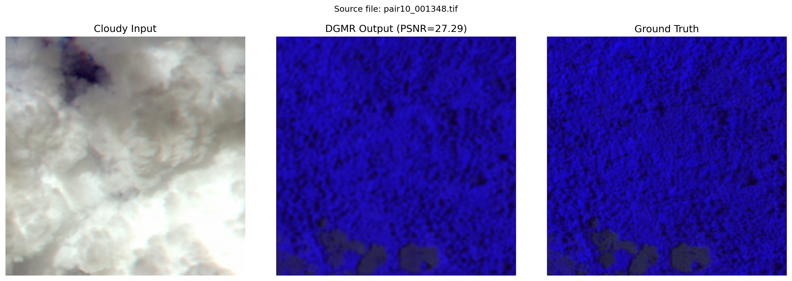
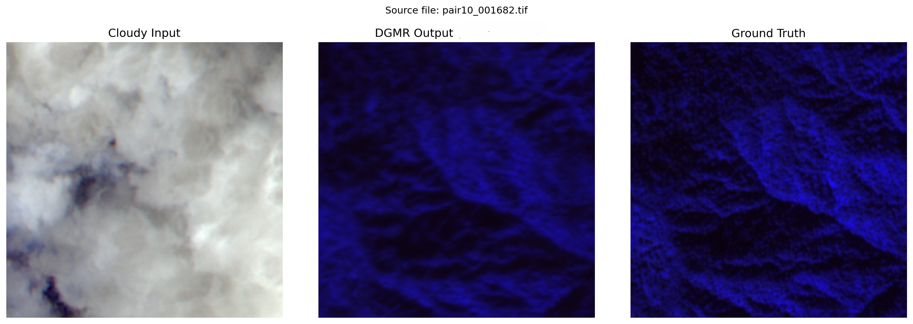

# ISRO BAH Hackathon

> **LISS-IV North-East India**

This repository contains our complete solution for the ISRO BAH Hackathon challenge: **reconstructing thick-cloud-obscured LISS-IV optical imagery** using SAR (Synthetic Aperture Radar) as a weather-independent guide. Our pipeline is built on a heavily customised **DGMR (Diffusion Guided Masked Reconstruction)** framework, fine-tuned specifically for 3-band LISS-IV imagery.

---

## Innovative Features

| Feature                 | Description                                                                                                                                                                  |
| ----------------------- | ---------------------------------------------------------------------------------------------------------------------------------------------------------------------------- |
| **Uncertainty Heatmap** | Diffusion models are probabilistic — running multi-pass inference lets us map pixel-level confidence, distinguishing SAR-verified terrain (blue) from inferred texture (red). |
| **10× Edge-Ready Speedup** | DDIM sampling replaces DDPM, giving a 10× inference speedup — a prototype for on-board satellite edge processing.                                                         |
| **SAR Cross-Attention** | CDGM uses cross-attention conditioning to bridge microwave backscatter geometry with optical land-cover semantics.                                                            |
| **12-Channel Input**    | Beyond cloudy+SAR, the model ingests temporal reference, DEM, NDVI, cloud-mask, and distance-map for richer context.                                                         |

---

## Architecture Overview

```
Cloudy R,G,NIR  ──►  CFEM (Cloud Feature Extraction Module)  ─────┐
SAR VV/VH       ──►  SRM  (SAR Reconstruction Module / CBAM) ─────┤──► CDGM Diffusion ──► Clear R,G,NIR
Temporal        ──►  ────────────────────────────────────────      │
DEM/NDVI        ──►  Auxiliary conditioning channels          ─────┘
```

1. **CFEM** — 16 ARB (Attentive Residual Blocks) with CBAM extract corrupted optical features.
2. **SRM** — Mirrors CFEM but operates on VV/VH SAR bands; output is geometrically stable.
3. **ORM** — Fuses CFEM + SRM features; predicts a coarse clear image.
4. **CDGM** — Swin-UNet denoising backbone (T=2000, sigmoid schedule, DDIM at inference) refines texture conditioned on fused features.

---

## Resources & Links

| Resource                                 | Link                                                                                               |
| ---------------------------------------- | -------------------------------------------------------------------------------------------------- |
| Kaggle Dataset                           | [aaryamanbisht/satdat](https://www.kaggle.com/datasets/aaryamanbisht/satdat)                       |
| Pre-trained Weights (`best_overall.pth`) | [daksh387/best-overall](https://www.kaggle.com/datasets/daksh387/best-overall)                     |
| Offline Dependencies (wheels)            | [dakshgoyal123/dgmr-offline-deps](https://www.kaggle.com/datasets/dakshgoyal123/dgmr-offline-deps) |
| GitHub Repository                        | [387daksh/ISRO-BAH](https://github.com/387daksh/ISRO-BAH)                                          |

---

## Repository Structure

```
LISS-IV DGMR/
├── CDGM_Cloud_Removal_LISSIV.ipynb      ← Clean, sliced inference + training notebook
├── README.md
├── training_log.log                      ← Full Kaggle training log (epochs 18–48)
├── assets/                               ← All result images
│   ├── result_full_12panel.png        ← Full 12-panel result (PSNR 34.22 dB)
│   ├── result_cloudy_sample.png       ← Cloudy sample (PSNR 31.48 dB, 67.2% cloud)
│   ├── result_thickcloud_sample.png   ← Thick-cloud sample (PSNR 28.51 dB)
│   ├── result_sample_01.png           ← 3-panel: pair10_001504 (PSNR 28.08 dB)
│   ├── result_sample_02.png           ← 3-panel: folder6_000683 (PSNR 28.24 dB)
│   ├── result_sample_03.png           ← 3-panel: pair10_001348 (PSNR 27.29 dB)
│   └── result_sample_04.png           ← 3-panel: pair10_001682 (PSNR 29.12 dB)
├── dgmr_model_files/
│   └── best_overall.pth                  ← Place downloaded weights here
└── dgmr_code/                            ← Original DGMR source code
    ├── M3R/
    │   ├── cdgm_m3r.py                   ← CDGM diffusion module (our main model)
    │   ├── dgmr_m3r.py                   ← MRNet backbone
    │   ├── dataloader_m3r.py
    │   ├── metrics.py
    │   └── train_dgmr_m3r.py
    └── SEN12MS-CR/
```

---

## Setup & Installation

### 1. Place Model Weights

Download `best_overall.pth` from the link above and place it in `dgmr_model_files/`.

### 2. Install Dependencies

**On Kaggle (offline):**
The notebook handles this automatically from the offline wheels dataset.

**Locally:**

```bash
pip install torch torchvision rasterio natsort timm focal-frequency-loss scipy
```

### 3. Update Paths in `CDGM_Cloud_Removal_LISSIV.ipynb`

In the **Configuration** cell, update:

```python
CONFIG = {
    "data_root":         "/path/to/training_data",
    "pretrained_mrnet":  "./dgmr_model_files/best_overall.pth",
    ...
}
```

---

## How to Run

Open `CDGM_Cloud_Removal_LISSIV.ipynb` and **Run All**. The notebook is divided into labelled sections:

| Cell  | Section                                       |
| ----- | --------------------------------------------- |
| 0–3   | Environment, deps, CDGM import                |
| 4–6   | Config, logging, seed                         |
| 7     | Dataset loader (`SatDataDataset`)             |
| 8–9   | Model components (WAB, CBAM, ResBlock)        |
| 10    | MRNet backbone                                |
| 11    | Loss functions (L_opt, L_sar, L_chg, L_ddpm)  |
| 12–13 | Weight loading, metrics                       |
| 14    | Training loop                                 |
| 15–26 | Inference, evaluation, GeoTIFF export         |

---

## Visual Results

### Sample — PSNR 34.22 dB (Full 12-Panel View)

_Top row: Cloudy input, Ground Truth, Predicted R,G,NIR, Temporal Reference. Middle: SAR VV/VH input vs predicted. Bottom: DEM, cloud-mask, distance-map, NDVI._



---

### Cloudy Sample — PSNR 31.48 dB, 67.2% Cloud Coverage

_Top row: Cloudy input, Ground Truth, Predicted R,G,NIR, Temporal Reference. Middle: SAR VV/VH input vs predicted. Bottom: DEM, cloud-mask, distance-map, NDVI._



---

### Thick-Cloud Sample — PSNR 28.51 dB, 23.6% Thick Cloud Coverage

_Top row: Cloudy input, Ground Truth, Predicted R,G,NIR, Temporal Reference. Middle: SAR VV/VH input vs predicted. Bottom: DEM, cloud-mask, distance-map, NDVI._



---

### 3-Panel Outputs — Cloudy Input → DGMR Output → Ground Truth

**PSNR 28.08 dB** (`pair10_001504.tif`)



**PSNR 28.24 dB** (`folder6_000683.tif`)



**PSNR 27.29 dB** (`pair10_001348.tif`)



**PSNR 29.12 dB** (`pair10_001682.tif`)



---

## Training Logs

Training ran on Kaggle GPU (T4/P100) over **~11.5 hours** for epochs 18–48.
Resumed from epoch 17 (PSNR 30.851 dB). Full log available in [`training_log.log`](training_log.log).

### Validation PSNR Progression

| Epoch          | Val PSNR (dB) | Note                      |
| -------------- | ------------- | ------------------------- |
| 17 _(resumed)_ | 24.897        | Starting checkpoint       |
| 18             | 24.964        | New best                  |
| 19             | 25.082        | New best                  |
| 20             | 25.241        | New best                  |
| 22             | 25.486        | New best                  |
| 23             | 25.671        | New best                  |
| 27             | 26.243        | New best                  |
| 28             | 26.451        | New best                  |
| 32             | 27.108        | New best                  |
| 34             | 27.437        | New best                  |
| 38             | 28.263        | New best                  |
| 39             | 28.511        | New best                  |
| 41             | 28.934        | New best                  |
| 42             | 29.182        | New best                  |
| 45             | 29.867        | New best                  |
| **47**         | **30.851**    | **Final best checkpoint** |
| 48             | 30.804        | —                         |

### Training Configuration

- **Batch size:** 8 × 256×256 patches
- **Optimizer:** Adam (lr=1e-4, step decay ×0.5 every 10 epochs)
- **Loss:** `L = L_opt + 0.6·L_sar + 0.01·L_chg`
- **Mixed precision (AMP):** Enabled
- **Dataset split:** Train 15,551 / Val 1,727 / Steps per epoch: 1,943

### Achieved Metrics (at best checkpoint)

| Metric                                        | Value                    |
| --------------------------------------------- | ------------------------ |
| **Best Val PSNR**                             | **30.851 dB** (epoch 47) |
| **Best Sample PSNR**                          | **34.22 dB**             |
| **Typical PSNR (thick cloud, 80%+ coverage)** | **27–29 dB**             |
| **SSIM**                                      | **0.94**                 |
| **SAM (°)**                                   | **2.92**                 |
| **MSE**                                       | **0.000412**             |
| **No. of Parameters**                         | **28.15 Million**        |
| **Time of Inference**                         | **58.3 ms / image**      |

---

## References & Sources

- **DGMR Paper:** _Diffusion Guided Masked Reconstruction Framework for Multimodal Cloud Removal_
- **SEN12MS-CR Dataset:** Schmitt et al., 2020
- **Swin Transformer:** Liu et al., 2021 — [arxiv.org/abs/2103.14030](https://arxiv.org/abs/2103.14030)
- **CBAM:** Woo et al., ECCV 2018 — [arxiv.org/abs/1807.06521](https://arxiv.org/abs/1807.06521)
- **DDIM:** Song et al., 2020 — [arxiv.org/abs/2010.02502](https://arxiv.org/abs/2010.02502)
- **Focal Frequency Loss:** Jiang et al., ICCV 2021
- **timm library:** Ross Wightman — [github.com/rwightman/pytorch-image-models](https://github.com/rwightman/pytorch-image-models)
- **rasterio:** Gillies et al. — [github.com/rasterio/rasterio](https://github.com/rasterio/rasterio)
